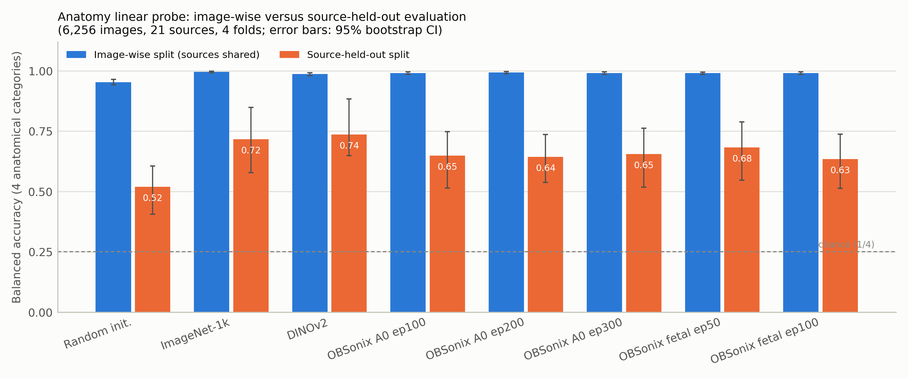
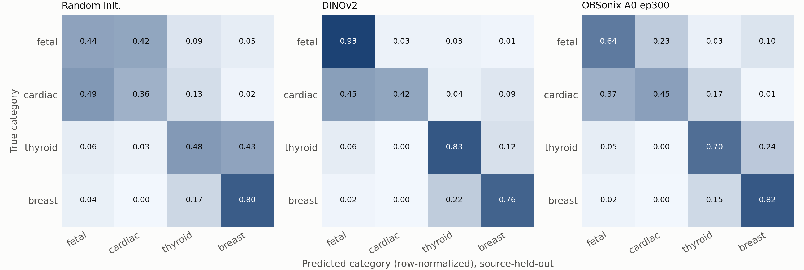
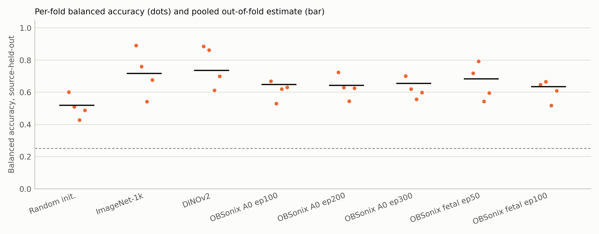
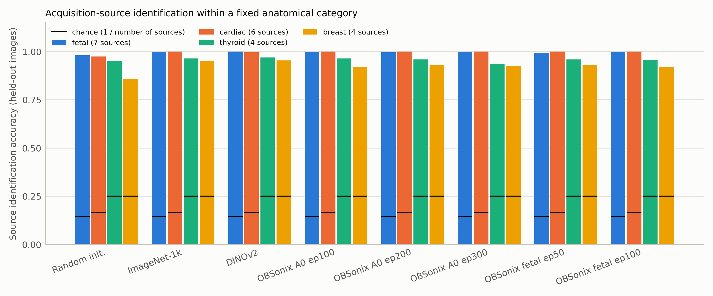
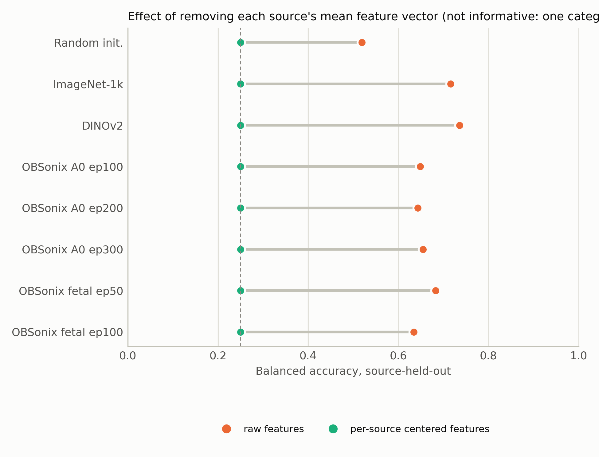

# EXP25_ANATOMY_PROBE_SOURCE_HELD_OUT : sonde anatomie à quatre catégories, sources tenues hors

Campagne `analyses3_anatomie4` (Drive : `/content/drive/MyDrive/OBSonix/eval/analyses3_anatomie4`), publiée automatiquement par l’étape S9 du notebook [`notebooks/OBSonix_sonde_anatomie4.ipynb`](../../notebooks/OBSonix_sonde_anatomie4.ipynb) (résultats S7 du 2026-09-23 11:16:39). Relancer le notebook depuis Colab avec le lien ci-dessus : chaque étape reprend là où elle s’est arrêtée et ce dossier est mis à jour à la fin.

## Question
La représentation gelée des encodeurs (aléatoire, ImageNet-1k, DINOv2, OBSonix A0 ep100/200/300, OBSonix fœtal ep50/100) sépare-t-elle l’anatomie (fetal, cardiac, thyroid, breast) lorsque les sources d’acquisition du test n’ont jamais été vues par la sonde ? Catégories restreintes à celles présentes dans au moins trois sources avec au moins 20 images par cellule, 300 images au plus par cellule, 6,256 images de 21 sources (18 groupes tenus hors), 4 plis, chaque pli de test contenant les quatre catégories.

## Verdict pré-enregistré
Pour l’encodeur principal (OBSonix A0 ep300), le signal anatomique **SURVIT** à la tenue hors des sources (critère : borne inférieure de l’IC à 95 % par grappe de sources > 97,5e centile de permutation, et estimation > ligne de base majoritaire).

| Encoder             |   Balanced accuracy |   CI lower (source cluster) |   Permutation 97.5th pct |   Majority baseline | Anatomy survives source hold-out   |
|:--------------------|--------------------:|----------------------------:|-------------------------:|--------------------:|:-----------------------------------|
| Random init.        |               0.519 |                       0.405 |                    0.269 |               0.155 | True                               |
| ImageNet-1k         |               0.716 |                       0.578 |                    0.277 |               0.155 | True                               |
| DINOv2              |               0.736 |                       0.648 |                    0.259 |               0.155 | True                               |
| OBSonix A0 ep100    |               0.648 |                       0.515 |                    0.286 |               0.155 | True                               |
| OBSonix A0 ep200    |               0.643 |                       0.537 |                    0.273 |               0.155 | True                               |
| OBSonix A0 ep300    |               0.655 |                       0.519 |                    0.286 |               0.155 | True                               |
| OBSonix fetal ep50  |               0.683 |                       0.546 |                    0.282 |               0.155 | True                               |
| OBSonix fetal ep100 |               0.635 |                       0.513 |                    0.28  |               0.155 | True                               |

## Rappel par catégorie, sources tenues hors (sonde équilibrée)
| Encoder             |   Recall fetal |   Recall cardiac |   Recall thyroid |   Recall breast |
|:--------------------|---------------:|-----------------:|-----------------:|----------------:|
| Random init.        |          0.436 |            0.359 |            0.482 |           0.798 |
| ImageNet-1k         |          0.8   |            0.611 |            0.682 |           0.771 |
| DINOv2              |          0.933 |            0.421 |            0.826 |           0.762 |
| OBSonix A0 ep100    |          0.739 |            0.423 |            0.629 |           0.802 |
| OBSonix A0 ep200    |          0.695 |            0.369 |            0.708 |           0.8   |
| OBSonix A0 ep300    |          0.642 |            0.453 |            0.703 |           0.82  |
| OBSonix fetal ep50  |          0.679 |            0.572 |            0.685 |           0.796 |
| OBSonix fetal ep100 |          0.621 |            0.461 |            0.664 |           0.792 |

## Figures

## Contenu du dossier
- `README_resultats.md` : rapport complet, avec le paragraphe de méthodes et de résultats en anglais prêt pour le manuscrit
- `S0_preenregistrement.md`, `S0_config.json` : question, critère principal, règle de décision et paramètres, écrits avant les résultats
- `S1_resume.md` : plan d’échantillonnage, sources par pli
- `tables/` : T1_anatomy_probe_main, T2_recall_by_category_source_held_out, T3_fold_design, T4_source_identification_control, T5_per_source_centering_ablation, T6_preregistered_verdict, T7_blinded_adjudication_summary, T8_blinded_adjudication_by_distance (CSV, Markdown, LaTeX)
- `figures/` : F1_balanced_accuracy_by_split, F2_confusion_source_held_out, F3_per_fold_dispersion, F4_source_identification_within_category, F5_per_source_centering (PNG 300 dpi et SVG)
- `metrics/` : échantillon, prédictions hors pli, bootstrap, permutations, matrices de confusion, contrôles source, ablation par centrage
- `JOURNAL.md` : journal horodaté de toutes les sessions ; `MANIFESTE.csv` : taille et SHA-256 de chaque fichier du dossier Drive
- `summary.md`, `summary.json` : résumé au format des autres expériences du dépôt

## Non inclus dans le dépôt
Les images du corpus (`S2_parts/`), les features des encodeurs (`features/*.npz`), les versions Parquet et les archives des versions précédentes restent sur le Drive (`/content/drive/MyDrive/OBSonix/eval/analyses3_anatomie4`).

Notebook publié depuis : session Colab.
