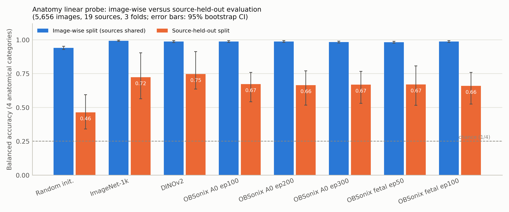
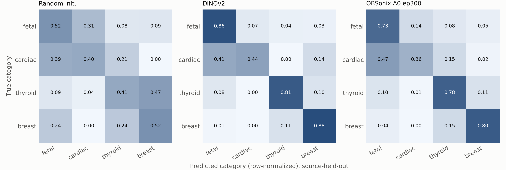
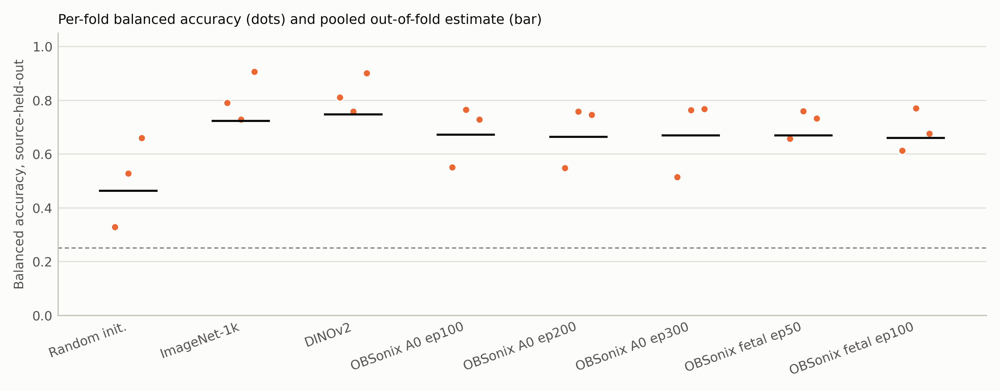
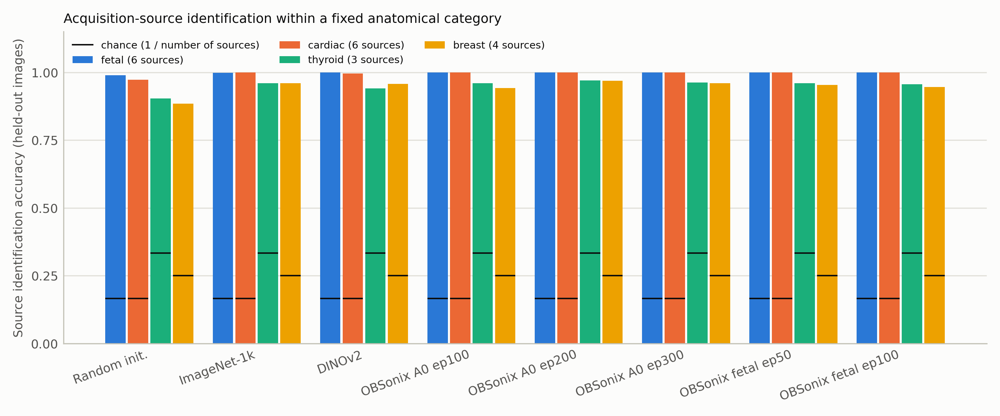
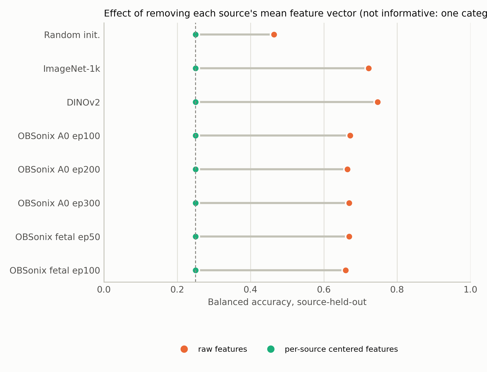
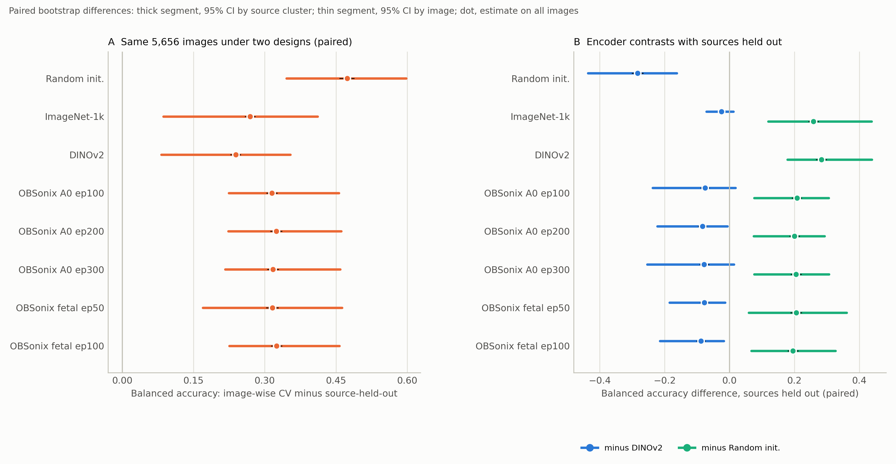

# EXP26_ANATOMY_PROBE_SOURCE_HELD_OUT_CORRECTED : sonde anatomie à quatre catégories, sources tenues hors

Campagne `analyses3_anatomie4b` (Drive : `/content/drive/MyDrive/OBSonix/eval/analyses3_anatomie4b`), publiée automatiquement par l’étape S9 du notebook [`notebooks/OBSonix_sonde_anatomie4b.ipynb`](../../notebooks/OBSonix_sonde_anatomie4b.ipynb) (résultats S7 du 2026-09-24 11:35:28). Relancer le notebook depuis Colab avec le lien ci-dessus : chaque étape reprend là où elle s’est arrêtée et ce dossier est mis à jour à la fin.

## Question
La représentation gelée des encodeurs (aléatoire, ImageNet-1k, DINOv2, OBSonix A0 ep100/200/300, OBSonix fœtal ep50/100) sépare-t-elle l’anatomie (fetal, cardiac, thyroid, breast) lorsque les sources d’acquisition du test n’ont jamais été vues par la sonde ? Catégories restreintes à celles présentes dans au moins trois sources avec au moins 20 images par cellule, 300 images au plus par cellule, 5,656 images de 19 sources (16 groupes tenus hors), 3 plis, chaque pli de test contenant les quatre catégories.

## Verdict pré-enregistré
Pour l’encodeur principal (OBSonix A0 ep300), le signal anatomique **SURVIT** à la tenue hors des sources (critère : borne inférieure de l’IC à 95 % par grappe de sources > 97,5e centile de permutation, et estimation > ligne de base majoritaire).

| Encoder             |   Balanced accuracy |   CI lower (source cluster) |   Permutation 97.5th pct |   Majority baseline | Anatomy survives source hold-out   |
|:--------------------|--------------------:|----------------------------:|-------------------------:|--------------------:|:-----------------------------------|
| Random init.        |               0.464 |                       0.34  |                    0.238 |               0.125 | True                               |
| ImageNet-1k         |               0.723 |                       0.564 |                    0.241 |               0.125 | True                               |
| DINOv2              |               0.747 |                       0.636 |                    0.255 |               0.125 | True                               |
| OBSonix A0 ep100    |               0.672 |                       0.542 |                    0.26  |               0.125 | True                               |
| OBSonix A0 ep200    |               0.664 |                       0.517 |                    0.256 |               0.125 | True                               |
| OBSonix A0 ep300    |               0.669 |                       0.53  |                    0.26  |               0.125 | True                               |
| OBSonix fetal ep50  |               0.669 |                       0.515 |                    0.249 |               0.125 | True                               |
| OBSonix fetal ep100 |               0.659 |                       0.524 |                    0.252 |               0.125 | True                               |

## Rappel par catégorie, sources tenues hors (sonde équilibrée)
| Encoder             |   Recall fetal |   Recall cardiac |   Recall thyroid |   Recall breast |
|:--------------------|---------------:|-----------------:|-----------------:|----------------:|
| Random init.        |          0.517 |            0.404 |            0.41  |           0.524 |
| ImageNet-1k         |          0.796 |            0.393 |            0.864 |           0.837 |
| DINOv2              |          0.857 |            0.442 |            0.811 |           0.879 |
| OBSonix A0 ep100    |          0.77  |            0.316 |            0.777 |           0.824 |
| OBSonix A0 ep200    |          0.756 |            0.334 |            0.75  |           0.817 |
| OBSonix A0 ep300    |          0.731 |            0.36  |            0.781 |           0.804 |
| OBSonix fetal ep50  |          0.754 |            0.412 |            0.723 |           0.788 |
| OBSonix fetal ep100 |          0.71  |            0.332 |            0.784 |           0.811 |

## Comparaison appariée sur les mêmes images (analyse post hoc du 24 septembre 2026, non pré-enregistrée)
Validation croisée par image à 3 plis sur les mêmes 5,656 images que le plan « sources tenues hors », différences appariées par bootstrap ; contrastes entre encodeurs dans `tables/T10_paired_encoder_contrasts.md`, figure `F6_paired_differences`.

| Encoder             | Image-wise 3-fold CV balanced accuracy [95% CI, image bootstrap]   | Source-held-out balanced accuracy [95% CI, source-cluster bootstrap]   | Paired difference, image-wise CV minus source-held-out [95% CI, image bootstrap]   | Paired difference [95% CI, source-cluster bootstrap]   | Image-wise CV, mean ± SD across 3 folds   |   Image-wise CV permutation null, 97.5th percentile |
|:--------------------|:-------------------------------------------------------------------|:-----------------------------------------------------------------------|:-----------------------------------------------------------------------------------|:-------------------------------------------------------|:------------------------------------------|----------------------------------------------------:|
| Random init.        | 0.937 [0.930; 0.944]                                               | 0.464 [0.340; 0.594]                                                   | +0.473 [+0.458; +0.488]                                                            | +0.473 [+0.346; +0.598]                                | 0.937 ± 0.006                             |                                               0.261 |
| ImageNet-1k         | 0.992 [0.989; 0.995]                                               | 0.723 [0.564; 0.903]                                                   | +0.269 [+0.259; +0.279]                                                            | +0.269 [+0.086; +0.411]                                | 0.992 ± 0.002                             |                                               0.262 |
| DINOv2              | 0.986 [0.982; 0.989]                                               | 0.747 [0.636; 0.912]                                                   | +0.239 [+0.228; +0.249]                                                            | +0.239 [+0.082; +0.354]                                | 0.986 ± 0.004                             |                                               0.262 |
| OBSonix A0 ep100    | 0.987 [0.983; 0.990]                                               | 0.672 [0.542; 0.758]                                                   | +0.315 [+0.304; +0.326]                                                            | +0.315 [+0.224; +0.456]                                | 0.987 ± 0.002                             |                                               0.261 |
| OBSonix A0 ep200    | 0.988 [0.985; 0.991]                                               | 0.664 [0.517; 0.770]                                                   | +0.324 [+0.312; +0.336]                                                            | +0.324 [+0.223; +0.461]                                | 0.988 ± 0.002                             |                                               0.262 |
| OBSonix A0 ep300    | 0.986 [0.983; 0.990]                                               | 0.669 [0.530; 0.767]                                                   | +0.317 [+0.306; +0.329]                                                            | +0.317 [+0.217; +0.459]                                | 0.986 ± 0.004                             |                                               0.262 |
| OBSonix fetal ep50  | 0.985 [0.982; 0.989]                                               | 0.669 [0.515; 0.807]                                                   | +0.316 [+0.304; +0.328]                                                            | +0.316 [+0.170; +0.463]                                | 0.985 ± 0.003                             |                                               0.262 |
| OBSonix fetal ep100 | 0.984 [0.981; 0.988]                                               | 0.659 [0.524; 0.758]                                                   | +0.325 [+0.314; +0.336]                                                            | +0.325 [+0.225; +0.457]                                | 0.984 ± 0.001                             |                                               0.261 |

## Figures

## Contenu du dossier
- `README_resultats.md` : rapport complet, avec le paragraphe de méthodes et de résultats en anglais prêt pour le manuscrit
- `S0_preenregistrement.md`, `S0_config.json` : question, critère principal, règle de décision et paramètres, écrits avant les résultats
- `S1_resume.md` : plan d’échantillonnage, sources par pli
- `tables/` : T10_paired_encoder_contrasts, T1_anatomy_probe_main, T2_recall_by_category_source_held_out, T3_fold_design, T4_source_identification_control, T5_per_source_centering_ablation, T6_preregistered_verdict, T7_blinded_adjudication_summary, T8_blinded_adjudication_by_distance, T9_like_for_like_image_cv_vs_source_held_out (CSV, Markdown, LaTeX)
- `figures/` : F1_balanced_accuracy_by_split, F2_confusion_source_held_out, F3_per_fold_dispersion, F4_source_identification_within_category, F5_per_source_centering, F6_paired_differences (PNG 300 dpi et SVG)
- `metrics/` : échantillon, prédictions hors pli, bootstrap, permutations, matrices de confusion, contrôles source, ablation par centrage
- `JOURNAL.md` : journal horodaté de toutes les sessions ; `MANIFESTE.csv` : taille et SHA-256 de chaque fichier du dossier Drive
- `summary.md`, `summary.json` : résumé au format des autres expériences du dépôt

## Non inclus dans le dépôt
Les images du corpus (`S2_parts/`), les features des encodeurs (`features/*.npz`), les versions Parquet et les archives des versions précédentes restent sur le Drive (`/content/drive/MyDrive/OBSonix/eval/analyses3_anatomie4b`).

Notebook publié depuis : session Colab.
